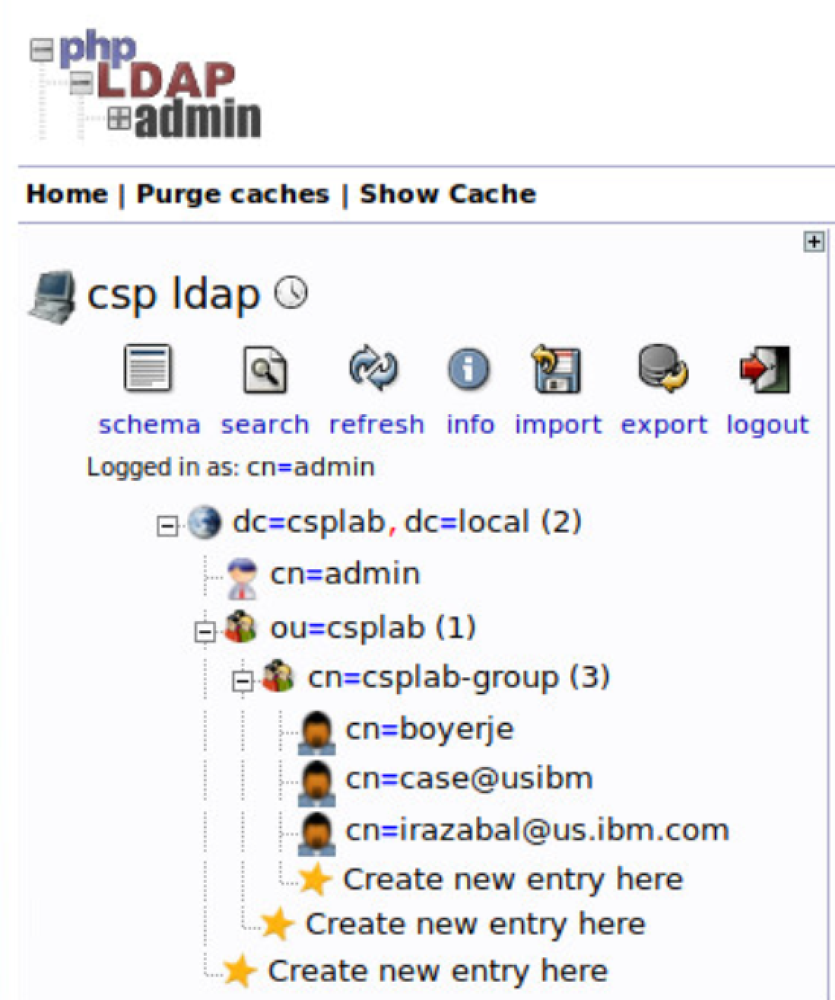

# Integration Utility Server
This project is used to define a Utility server used to host IBM secure gateway client, jenkins server for CI/CD, and LDAP server for simple user management.

This project is part of the 'IBM Integration Reference Architecture' suite, available at [https://github.com/ibm-cloud-architecture/refarch-integration](https://github.com/ibm-cloud-architecture/refarch-integration)

## Server configuration
The following steps can be done manually to create a VM with Ubuntu. We are using vmware vSphere center.
* Create a vm machine for a Ubuntu (64 bits) OS using ESXi 5.5
* Get the iso image for ubuntu 16.10
* Create a user *brownuser*
* setup ssh server
* disable firewall

To validate the OS version user
```
$ lsb_release -a
```
To complement the installation the [following](docs/sg_install_linux_client.md) was done
## Secure Gateway configuration
The [article](docs/ConfigureSecureGateway.md) goes in details on how to configure IBM secure gateway service in Bluemix and the client configuration.

## Continuous integration with Jenkins
See details in this [note](docs/cicd.md)

## LDAP configuration
The LDAP server used in this project is openLDAP. It was configured via the following instructions:
https://www.digitalocean.com/community/tutorials/how-to-install-and-configure-a-basic-ldap-server-on-an-ubuntu-12-04-vps
The base DNs of the LDAP server is dc=csplab dc=local.

Once installed, PHPldapadmin was installed and configured following instructions from the link above. See config.php.

The following structure was done for testing:


To validate the LDAP server is working fine execute the command `ldapsearch -x -LLL -h 172.16.50.9  -b "dc=csplab,dc=local"`, it should return something like:
```
dn: dc=csplab,dc=local
objectClass: top
objectClass: dcObject
objectClass: organization
o: csplab
dc: csplab

dn: cn=admin,dc=csplab,dc=local
objectClass: simpleSecurityObject
objectClass: organizationalRole
cn: admin
description: LDAP administrator

dn: ou=csplab,dc=csplab,dc=local
objectClass: organizationalUnit
objectClass: top
ou: csplab

dn: cn=csplab-group,ou=csplab,dc=csplab,dc=local
gidNumber: 500
cn: csplab-group
objectClass: posixGroup
objectClass: top

dn: cn=boyerje,cn=csplab-group,ou=csplab,dc=csplab,dc=local
givenName: Jerome
gidNumber: 500
homeDirectory: /home/users/boyerje
sn: boyer
objectClass: inetOrgPerson
objectClass: posixAccount
objectClass: top
uidNumber: 1002
uid: boyerje
cn: boyerje
...
```
