# Configure Secure Gateway
This article addresses in details how the Secure gateway was configured for **Brown Compute**.

[IBM Secure Gateway Service](https://console.ng.bluemix.net/docs/services/SecureGateway/secure_gateway.html) (SG) provides secure connectivity and establishes a tunnel between your Bluemix organization and the remote location that you want to connect to. Remote locations could be other cloud platform but in our case are on-premise services (web service, REST, LDAP...).

This is a major component for [Hybrid integration](https://github.com/ibm-cloud-architecture/refarch-integration) so very important to understand how it works and how to configure it with TLS settings. Alternate to SG is to set a private VPN.

## Goal
The connection from the Bluemix app has to be secure end to end. So we are configuring the following approach: TLS mutual auth between bluemix app and secure gateway, and TLS between destination and secure gateway   
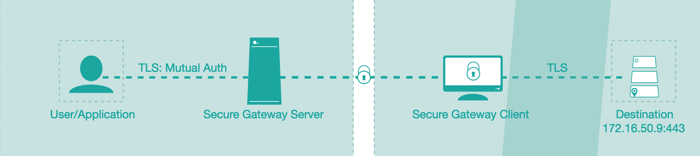  

## Pre-requisites
You need to have
* a Bluemix account
* a server, linux based, within the same network as the application end point you want to integrate. In this case the API Connect gateway server.
* administration privileges on this server


## Steps to perform
The following diagram illustrates what needs to be done to setup secure connection between Bluemix application and an on-premise end point being an API Connect exposed API.
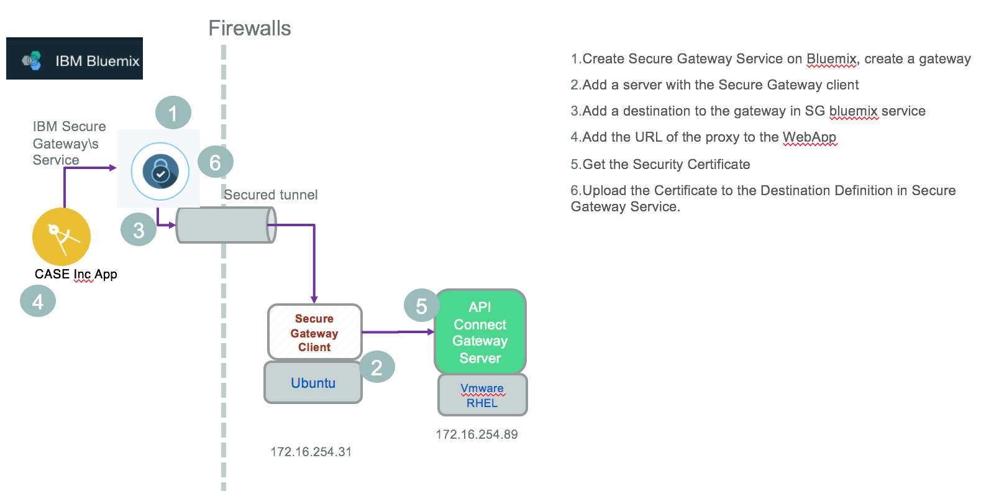

### Step 1- Create secure gateway service in Bluemix
In your Bluemix account / organization create a IBM Secure Gateway service using the path Catalog> Integrate > Secure Gateway.  In the diagram below the service is named "Secure Gateway-p4".

 Add one instance of gateway using the + icon (e.g. named BrownSecureGtw),
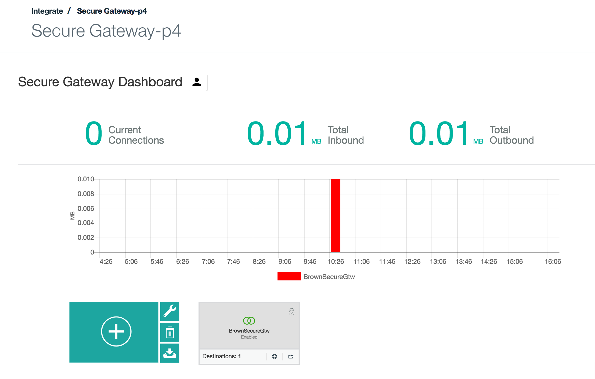

 select security token and token expiration options.
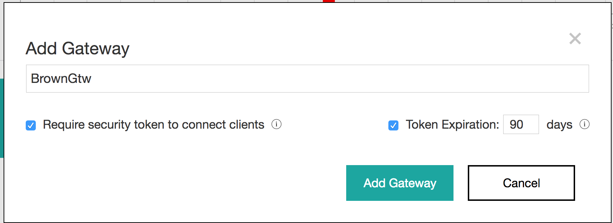{:height="312px" width="857px"}

 Double click on the newly created gateway, so you can access the gateway **dashboard** from where you should be able to add client, destination and see the gateway parameters.  
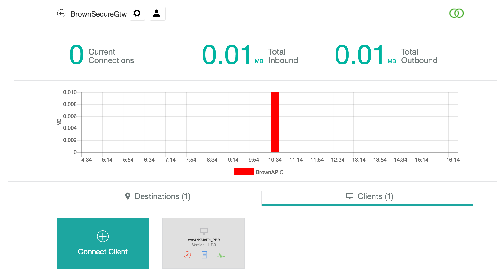

For example, via the settings menu (the gear icon on the right side of the gateway name), you should be able to access the gateway details:  
 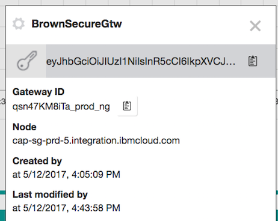

 The `security token key` string and the `Gateway ID` are needed when you will configure the secure gateway client (see next section). The `Node` is the name of the server you will use from the bluemix app to connect to the gateway. The URL used by the client application point to this node:
 ```javascript
 // Access Inventory api exposed via API Connect with the following path: csplab/sb/sample-inventory-api
 // and with secure gateway end point  cap-sg-prd-5.integration.ibmcloud.com
 const apiUrl="cap-sg-prd-5.integration.ibmcloud.com:16582/csplab/sb/sample-inventory-api/items";
 request.get(
     {url:apiUrl
    })
 ```   

### Step 2- Configure secure gateway client server
On the on-premise server install one of the secure gateway client: docker image or OS specific client.

Using your Web browser, within the Secure Gateway Dash board > Select `+ Connect client` choice:
 

select one of the installer:
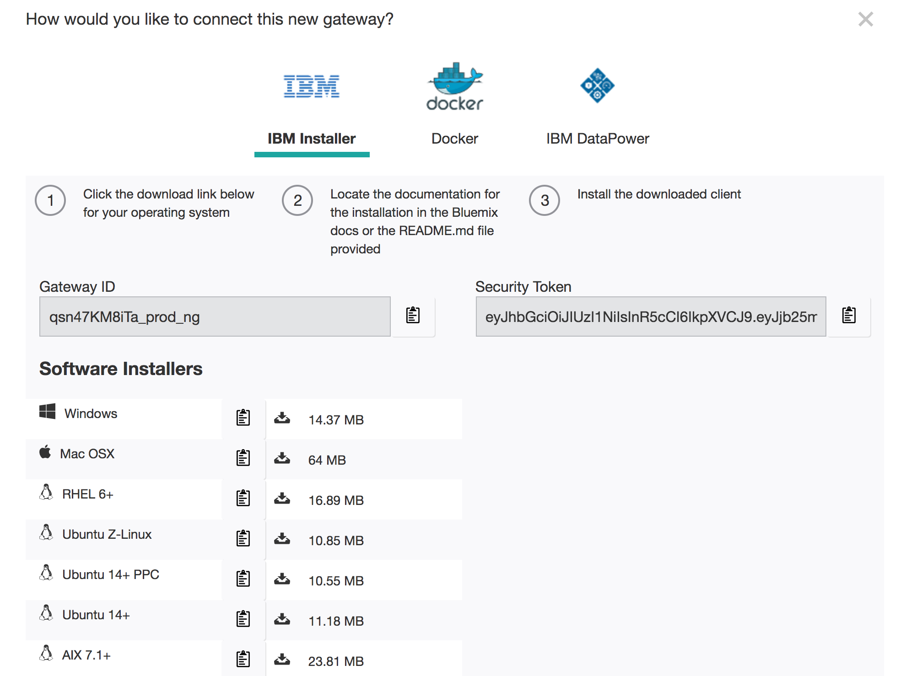

`Remark: the Gateway ID and Security token in this screen match the detail parameter of the secure gateway`.

#### Docker
During development and for convenience you may want to pick up the Docker image by performing the following steps.

 ```
# download the docker image
$ sudo docker pull ibmcom/secure-gateway-client
# Verify the docker images
$ docker images
# then start the secure gateway client using the command
$ sudo docker run -P -it ibmcom/secure-gateway-client <secure-gateway-id> -t <token-string>
# to see the client process running                                  
$ ps -ef
# to reconnect to the secure gateway client
$ docker ps -a
$ docker attach <docker id>
# to restart a container
$ docker restart <dockerid>
```  
The following image presents the secure gateway client command line interface with the results from the command `CLI> C 1` to display the configuration information  

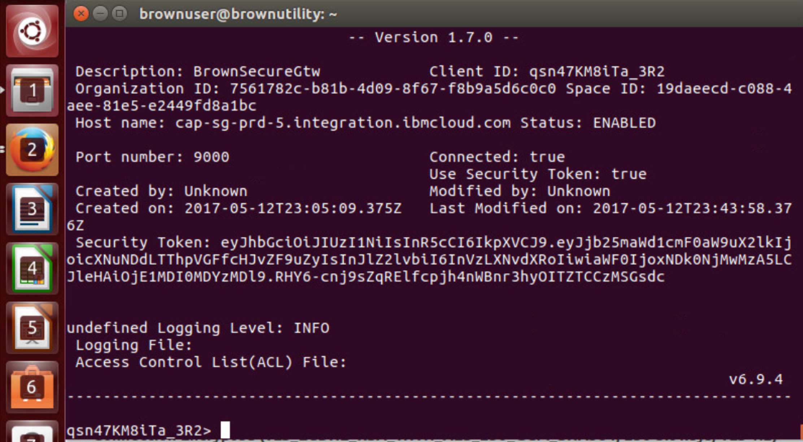  

The prompt  string represents the unique identifier of the client, it will be visible on the Bluemix Secure Gateway dashboard when the client is connected.


#### Direct install
For production deployment, the tests illustrated some performance challenges with docker image, so we decided to directly install the secure gateway client. The steps are defined in the [product documentation] depending of the server OS, but as there are some questions / steps not clear we summarize them here too:  

In the software installer section, select your target OS, it should download the installer file. Then do the following:  

* Install the client code using the following command on **Ubuntu**. Be sure to be root user or a user who is part of the *sudoers* (see this note to add user as sudoers)

```
sudo dpkg -i ibm-securegateway-client-1.4.1+client_amd64.deb
```
For **RedHat 7.x**:
```
rpm -ivhf --force ibm-securegateway-client-1.4.1+client_amd64.rpm
```
During the installation the followng information are needed:
 * gateway ID: it can be found in Bluemix Secure Gateway instance
 * security token: it is also available in the Secure Gateway instance
 * if you want to start the secure gateway automatically or not
 * Specify the trace level: information
 * Specify the Access Control List (ACL) file: specify none for the moment. See the section about [ACL]()
 * Provide the port number for the web based user interface: 9003

The command adds a *secgwadmin* group and the *secgwadmin* user, and persists the configuration in the file `/etc/ibm/sgenvironment.conf`. It also defines some links to `/usr/local/bin` so the secure gateway client can be started from command line.

Verify the configuration, the connection and the port number the user interface is using
```
cat /var/log/securegateway/client_console.log

IBM Bluemix Secure Gateway Client Version 1.7.0

[INFO] (Client ID 1259) No password provided. The UI will not require a password for access
[WARN] (Client ID 1259) UI Server started. The UI is not currently password protected
[INFO] (Client ID 1259) Visit localhost:9003/dashboard to view the UI.
[INFO] (Client ID 1735) Setting log level to INFO
[INFO] (Client ID 1735) The Secure Gateway tunnel is connected
[INFO] (Client ID qsn47KM8iTa_6pQ) Your Client ID is qsn47KM8iTa_6pQ
(Client ID qsn47KM8iTa_6pQ) Synchronizing ACL rules

```

To stop the client use the systemctl command like:
`sudo systemctl stop securegateway_client` and to disable at system boot time `systemctl disable securegateway_client`

To get the status of the secure gateway on the server run the command:
` systemctl status securegateway_client` then to restart `sudo systemctl start securegateway_client`

Here is an example of trace:
```
brownuser@brownutility:/var/log/securegateway$ systemctl status securegateway_client
● securegateway_client.service - IBM Secure Gateway Client for Bluemix
   Loaded: loaded (/lib/systemd/system/securegateway_client.service; enabled; vendor preset: enabled)
   Active: active (running) since Wed 2017-06-14 17:10:26 PDT; 26s ago
  Process: 5682 ExecStop=/bin/bash -c /usr/local/bin/securegateway_clientd stop (code=exited, status=0/SUCCESS)
 Main PID: 5750 (securegateway_c)
    Tasks: 22 (limit: 4915)
   Memory: 62.2M
      CPU: 1.172s
   CGroup: /system.slice/securegateway_client.service
           ├─5750 /bin/bash /usr/local/bin/securegateway_clientd start
           ├─5766 /bin/bash /usr/local/bin/securegateway_clientd start
           ├─5767 sgclient_parent
           └─5774 sgclient_qsn47KM8iTa_qpJ

Jun 14 17:10:26 brownutility systemd[1]: Started IBM Secure Gateway Client for Bluemix.
Jun 14 17:10:26 brownutility bash[5750]: Performing start operation

```

It is also possible to verify the connection using a Web Browser a the url https://locahost:9003/dashboar on the client host
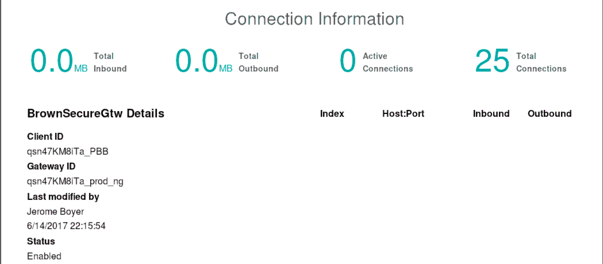  
The Client ID should match the ID on the gateway server in Bluemix. Same for the Gateway ID.

### Step 3- Define destination for secure gateway service
In Bluemix Console, back to the Secure Gateway dashboard, the client should be visible in the list of connected clients. The client id should match the id returned by the secure client trace as illustrated below (the string with _3R2)

The client makes a connection to the service instance running in Bluemix and then opens a bi-directional tunnel so data can be sent from a Bluemix app to the on-premise server. In the case of this integration, the server is the API Connect gateway running on IP 172.16.50.8:443.

 Use the add destination from the Dashboard,
 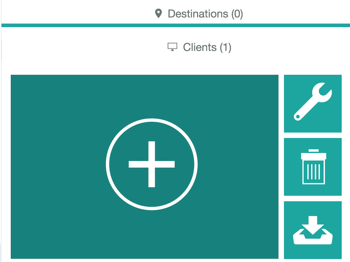   

and follow the step by step wizards:
* This is an on-premise destination as the API Connect gateway server runs there
* Specific the security connection type between the client and the secure gateway and then between the secure gateway client and the final destination. The following figure illustrates one potential settings (TLS mutual auth between bluemix app and secure gateway, and TLS between destination and secure gateway):   
  

Once done the new destination is added, and using the gear icon it is possible to access the detail of the destination.
The TLS options below presents the matching setting of the previous high level view.
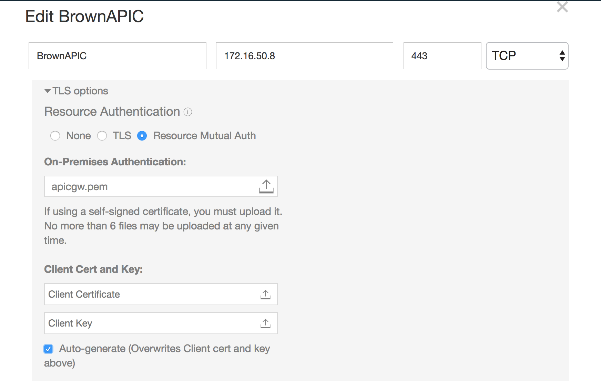
So we need to update the certificate. The `apicgw.pem` is a file created by executing the command:
```
echo | openssl s_client -connect 172.16.50.8:443 -showcerts 2>&1 | sed  -n '/BEGIN CERTIFICATE/,/-END CERTIFICATE-/p'> apicgw.pem
```
and then uploaded to the Destination definition inside the gateway dashboard.
One important elements to remember is the **Cloud Host** name, as it is needed for the bluemix app to call the on-premise app.
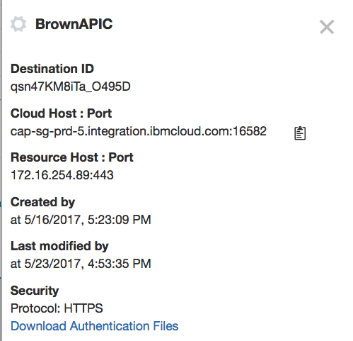


The server provides a set of certificates. Download the authentication files from the detail view. It is a zip file containing the TLS certificates.  The following table illustrates what to do with those files:

| File  | Intent |  Usage  |
| ----- | ------ | --- |
| apicgw.pem | Certificate from destination host | It was uploaded in Secure Gateway Destination definition |
| qsn47KM8iTa_clientCert.pem | certificate for client | We selected auto-generate to automatically create a self-signed certificate/key pair. This is one of the file. See note below|
| qsn47KM8iTa_clientKey.pem | private key for a client | Needed as input for the key store on client side |
| DigiCertCA2.pem | Certificate Authority certificate | Needed to add it to client trust store |
| DigiCertTrustedRoot.pem | Secondary CA certificate | Needed to add it to client trust store |
| secureGatewayCert.pem | Secure Gateway certificate | Also needed to add to client trust store|
| ----- | ------ | -- |  
All those files are saved in the Case Inc Portal repository under ssl folder. For security reason they are not push in git.

The client certificate and client key are used to create a key store with a command like:
`openssl pkcs12 -export -in "./ssl/qsn47KM8iTa_O495D_destCert.pem" -inkey "./ssl/qsn47KM8iTa_O495D_destKey.pem" -out "ssl/sg_key.p12" -name "CaseIncCliCert" -noiter -password pass:"asuperpwd"`

## ACL
 Access Control List entries determine what the client is allowed to access on a host:port basis. To fine control the access the API Connect Gateway IP and Port number are specified, using the Secure Gateway Client dashboard user interface at 'http://localhost:9003/dashboard'. The local host being the BrownUtility server.

## Tracing the secure gateway client
 In the secure gateway client command line interface it is possible to set the trace in Debug mode using the command below
 ```
 l DEBUG
 ```
 So it is possible to see the connection coming in from Bluemix Secure gateway  as illustrated in figure below.
 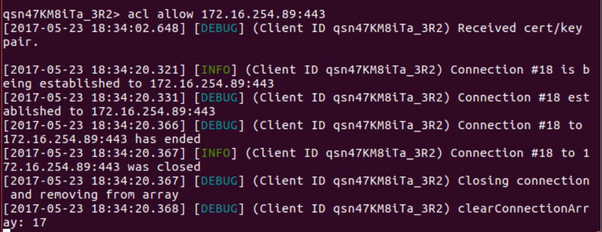  


## References
* [Bluemix Secure Gateway Service/product Documentation](https://console.ng.bluemix.net/docs/services/SecureGateway/secure_gateway.html)
* [Reaching Enterprise Backend with Bluemix Secure Gateway via SDK API](https://www.ibm.com/blogs/bluemix/2015/04/reaching-enterprise-backend-bluemix-secure-gateway-via-sdk-api/)
* [Reaching enterprise backend with Bluemix Secure Gateway via console](https://www.ibm.com/blogs/bluemix/2015/04/reaching-enterprise-backend-bluemix-secure-gateway/)
* Real life experience with Secure Gateway with nice FAQ, a must to read
[part 1](https://www.ibm.com/blogs/bluemix/2015/11/secure-gateway-in-production-part1/)
[part 2](https://www.ibm.com/blogs/bluemix/2015/11/secure-gateway-in-production-part2/)
* [](https://www.ibm.com/blogs/bluemix/2015/05/bluemix-hybrid-integration/)
