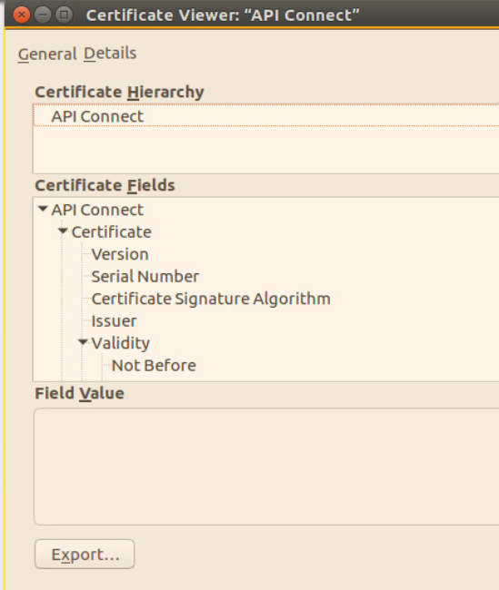
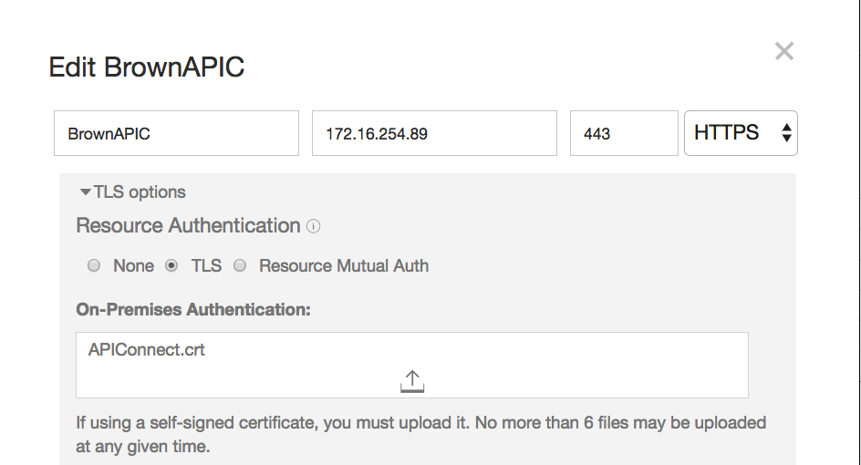

# Configure Secure Gateway
This article addresses in details how the Secure gateway was configured for Brown Compute.

## Pre-requisites
You need to have
* a Bluemix account
* a server, linux based, within the same network as the application end point to the destination. In this case the API Connect gateway server.
* Have administration privileges on the server

[IBM Secure Gateway Service](https://console.ng.bluemix.net/docs/services/SecureGateway/secure_gateway.html) provides secure connectivity and establishes a tunnel between your Bluemix organization and the remote location that you want to connect to.


## Steps to perform
The following diagram illustrates what needs to be done to setup secure connection between Bluemix application and an on-premise end point being an API Connect exposed API.


### 1- Create secure gateway service in Bluemix
In your Bluemix account / organization create a IBM Secure Gateway service using the path Catalog> Integrate > Secure Gateway.  In the diagram below the service is named "Secure Gateway-p4".

 Add one instance of gateway (e.g. named BrownSecureGtw), using security token and token expiration options. In the Bluemix Secure Gateway service >  Manage menu access the Dashboard user interface, and then the settings menu (via the gear icon):  
   

 to access the server details:  
 

 The security token key string and the Gateway ID are needed for the secure gateway client settings you will do later.

### 2- Configure secure gateway client server
On the on-premise server install one of the secure gateway client. During development and for convenience we picked up the Docker image by performing the following steps.

 ```
# download the docker image
$ sudo docker pull ibmcom/secure-gateway-client
# Verify the docker images
$ docker images
# then start the secure gateway client using the command
$ sudo docker run -P -it ibmcom/secure-gateway-client <secure-gateway-id> -t <token-string>
# to see the client process running                                  
$ ps -ef
# to reconnect to the secure gateway client
$ docker ps -a
$ docker attach <docker id>
# to restart a container
$ docker restart <dockerid>
```  
The following image presents the secure gateway client command line interface with the results from the command "C 1" to display the configuration
  

 The prompt  string represents the unique identifier of the client, it will be visible on the Bluemix Secure Gateway dashboard when the client is connected.

 For production deployment, the tests illustrate some performance challenges with docker image, so direct installation of the secure gateway client based on the operation is a better option. To do so see the specific [note](sg_install_linux_client.md)

### 3- Define destination for secure gateway service
Back to the Secure Gateway Service dashboard, the client should be visible in the list of connected client. The client id should match the id returned by the docker run as illustrated below (the string with _3R2)

 The client makes a connection to the service instance running in bluemix and then open a bi-directional tunnel so data can be sent from a Bluemix app to the on-premise server. In the case of this integration, the server is the API Connect gateway running on IP 172.6.254.89:443.

 Use the add destination from the Dashboard, and follow the step by step wizards
 

 Once done the new destination is added, and using the gear icon it is possible to access the detail of the destination. One important elements is the cloud host name that is needed for the bluemix app to call the on-premise app.
 


### 4- Modify the application code to access secure gateway proxy

When the client is set up and running, we need to add destination for the on-premise application end-point. You need to gather a set of information for your end points:
 * The IP address or host name
 * The type of protocol to support, HTTS or
 * any user authentication credentials used to access the service.

 The example below is a simple nodejs script to do a HTTP request to the bluemix proxy. The headers settings are coming from the API Connect configuration. (See []())
```javascript
request.get(
    {url:'https://cap-sg-prd-5.integration.ibmcloud.com:16582/csplab/sb/sample-inventory-api/items',
    timeout: 10000,
    headers: {
      'x-ibm-client-id': '1dc939dd-xxxx',
      'accept': 'application/json',
      'content-type': 'application/json'
      }
    },
```

 What is important to understand that the cap-sg-prd-5... is a public server, so it is possible to use *curl* to test the connection outside of any app code.
  ```
curl -H "content-type:application/json" -H "accept: application/json" -H "x-ibm-client-id: 1dc939dd-xxxx"  https://cap-sg-prd-5.integration.ibmcloud.com:16582/csplab/sb/sample-inventory-api/items
  ```

In the secure gateway client command line interface it is possible to set the trace in Debug mode using the command below
```
l DEBUG
```
so it is possible to see the connection coming in from Bluemix Secure gateway  as illustrated in figure below.
  

### 5- Download the API Connect certificate  
 The connection between bluemix app to back end data access service needs to be over HTTPS, HTTP over SSL. To make SSL working end to end we need to do certificate management, configure trust stores, understand handshaking, and other details that must be perfectly aligned to make the secure communication work. [See SSL summary](ssl.md)

To access the certificate use a Web browser, like Firefox, to the target URL using HTTPS. Access the Security > Certificate from the locker icon on left side of the URL field. (Each web browser has their own way to access to the self certified certificates)



Use the export button to create a new local file with suffix .crt. From there you need to persist the file on the operating system trust store.

 ```
# get certificate in the form of a .crt file, then mv it to ca-certificate
$ sudo mv APIConnect.crt /usr/local/share/ca-certificate
# To add en try to the certificates use the command
$ sudo update-ca-certificates
# verify with
$ ls -al /etc/ssl/certs | grep APIConnect
$ openssl s_client -showcerts -connect 172.16.254.89:443
```

### 6- Add certificate to destination  
Save the certificate as file, (e.g. APIConnect.crt) and then upload it in the destination configuration of the Secure Gateway Bluemix Service.


## Specific to Java Trust store
Java Runtime Environment comes with a pre-configure set of trusted certificate authorities. The collection of trusted certificates can be found at $JAVA_HOME/jre/lib/security/cacerts The tests are run on the utility server, so the API Connect server CA certificate needs to be in place. To do so the following needs to be done:

Remote connect to the API Connect Gateway Server with a Web Browser and download the certificate as .crt file
```
$ sudo keytool -import -trustcacerts -alias brownapic -file APIConnect.crt -keystore $JAVA_HOME/jre/lib/security/cacerts -storepass changeit
$ keytool -list -keystore $JAVA_HOME/jre/lib/security/cacerts
```

## References
* [Bluemix Secure Gateway Service Documentation](https://console.ng.bluemix.net/docs/services/SecureGateway/secure_gateway.html)
* [Reaching Enterprise Backend with Bluemix Secure Gateway via SDK API](https://www.ibm.com/blogs/bluemix/2015/04/reaching-enterprise-backend-bluemix-secure-gateway-via-sdk-api/)
* [Reaching enterprise backend with Bluemix Secure Gateway via console](https://www.ibm.com/blogs/bluemix/2015/04/reaching-enterprise-backend-bluemix-secure-gateway/)
* Real life experience with Secure Gateway
[part 1](https://www.ibm.com/blogs/bluemix/2015/11/secure-gateway-in-production-part1/)
[part 2](https://www.ibm.com/blogs/bluemix/2015/11/secure-gateway-in-production-part2/)
* [](https://www.ibm.com/blogs/bluemix/2015/05/bluemix-hybrid-integration/)
